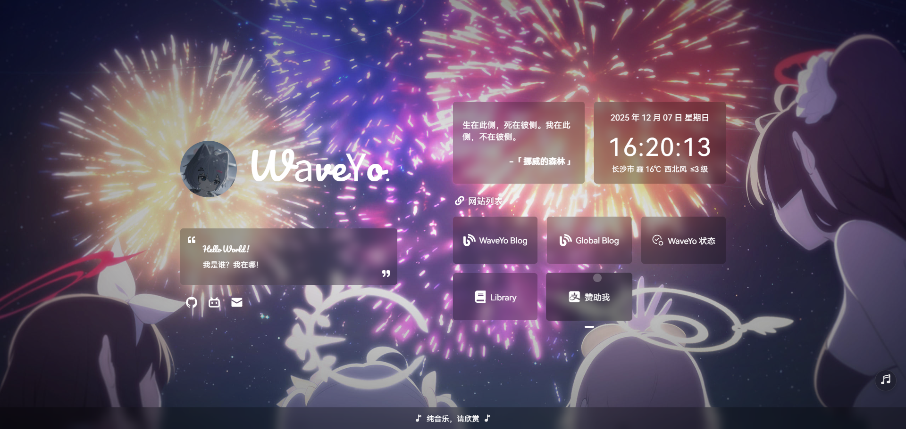

English | [Chinese](./README.md)

> [!IMPORTANT]
> ## To Everyone
> This project is forked from the archived [imsyy/home](https://github.com/imsyy/home) project. Since the original author has archived it, new needs should be solved by ourselves.
>
> This project follows [MIT](LICENSE) and [imsyy/LICENSE](imsyy_LICENSE) and remains open source.

<strong><h2>WaveYo Home</h2></strong>



> The logo font on the homepage has been compressed. If you use letters other than this site’s logo, they will fall back to the default font. Here is the [full font](https://file.imsyy.top/font/Other/Pacifico-Regular.ttf). If the download fails, you can replace `Pacifico-Regular-all.ttf` in the font directory.

### Demo

> Due to CDN caching, you may need `Ctrl` + `F5` to force-refresh the browser cache to see the latest effect

- [WaveYo Home](https://home.waveyo.cn)

### Features

- [x] Loading animation
- [x] Site description
- [x] Hitokoto quote
- [x] Date and time
- [x] Live weather
- [x] Time progress bar
- [x] Music player
- [x] Mobile adaptation

### Auto Deployment

If you encounter errors in the build environment or packaging, you can use `GitHub Actions` to build automatically.

- After successfully `fork`ing the repository, go to the `Actions` page. If you are enabling it for the first time, you will see the prompt below; click to enable.

  

- Then any change in the repository will trigger the workflow. After it completes, a downloadable archive will be generated below. That archive contains the built static files, which you can upload to your server.

  

### Manual Deployment

- **Install** the [node.js](https://nodejs.org/zh-cn/) **environment**

  > node > 16.16.0  
  > npm > 8.15.0

- Run the `cmd` terminal with **administrator privileges**, and `cd` to the project root
- In the terminal, run:

```bash
# Install pnpm
npm install -g pnpm

# Install dependencies
pnpm install

# Preview
pnpm dev

# Build
pnpm build
```

> After the build completes, static assets are generated in the `dist` directory. Upload the files under `dist` to your server, or use a hosting platform like `Vercel` for one-click import and auto-deploy.

### Docker Deployment

> Installing and configuring Docker is not covered here. Please handle it yourself.

```bash
# Build
docker build -t home .
# Run
docker run -p 12445:12445 -d home
```

### Vercel Deployment

> Other platforms are roughly similar and are not described here.

1. Click `Fork` in the upper-right corner to copy this repository to your GitHub account
2. Copy `/.env.example` and rename it to `/.env` (Important)
3. Modify configurations in `/.env` as needed
4. Click `Deploy` to deploy successfully

### Site Links

You can customize site links in `src/assets/siteLinks.json` (to point to your sites):

```json
{
  "icon": "Blog",
  "name": "Blog",
  "link": "https://blog.imsyy.top/"
}
```

Icons for site links can be added in `src/components/Links/index.vue`:

```js
// You can choose icons at https://www.xicons.org and import them here
// This imports icons of type fa
import {
  Link,
  Blog,
  CompactDisc,
  Cloud,
  Compass,
  Book,
  Fire,
  LaptopCode,
} from "@vicons/fa";

// Site link icons
const siteIcon = {
  Blog,
  Cloud,
  CompactDisc,
  Compass,
  Book,
  Fire,
  LaptopCode,
};
```

### Social Links

You can customize social links in `src/assets/socialLinks.json`.

### Weather

Weather and location data require APIs from `Amap Open Platform`.

- Go to the [Amap Console](https://console.amap.com/dev/index), create a `Web Service` type `Key`, and fill it into `VITE_WEATHER_KEY` in `.env`.

You can also replace it with other methods.

### Music

> This project uses the `Aplayer` music player based on `MetingJS`, enabling quick custom playlists  
> *Only supported in **Mainland China**

Change the song-related parameters in `.env` to customize the playlist:

```bash
# Songs API address
VITE_SONG_API = "https://music.waveyo.cn/api"
# Song server ( netease-netease, tencent-qq music )
VITE_SONG_SERVER = "netease"
# Playback type ( song, playlist, album, search, artist )
VITE_SONG_TYPE = "playlist"
# Playback ID
VITE_SONG_ID = "12752948320"
```

### Fonts

Currently using the open-source `HarmonyOS Sans` with font splitting to improve load speed.

> Since the site’s CDN has anti-leech enabled, **non-site domains cannot access it**. Please change the font import link to the content below; otherwise **custom fonts will be invalid**.
>
> `https://s1.hdslb.com/bfs/static/jinkela/long/font/regular.css`

<details>
<summary>Old method</summary>

> Because this project introduces Chinese fonts, you need to compress them to improve page loading speed (or cancel using Chinese fonts).

#### Remove Traditional Chinese glyphs

- Install `Python 3.7` and `pip`
- Run `pip install fonttools`
- Download [sc_unicode.txt](https://gist.githubusercontent.com/imaegoo/d64e5088b723c2e02c40985f55ff12db/raw/5ebd2ce49418c73459a9dfe050483409306a6c1d/sc_unicode.txt)
- Run `pyftsubset font-name.ttf --unicodes-file=sc_unicode.txt`

#### Further compress fonts

- Compile and install `Google woff2`

```bash
sudo apt-get install -y git g++ make
git clone --recursive https://github.com/google/woff2.git
cd woff2
make clean all
```

- Compress the font again

```
./woff2_compress ./font_name.ttf
```

- Finally, you can lazy-load the original font, **loading the compressed font first**

> For details, see the original article at [虹墨空间站](https://www.imaegoo.com/2020/chinese-font-compress/)

</details>

### Site Icon & Background

#### Background

You can change the site background in `public/images`.

If you want to add more local images as backgrounds, rename images with the form `background+number`, and modify `src/components/Background/index.vue`:

```js
if (type == 0) {
  // Change the first number after Math.random() to the count of images
  bgUrl.value = `/images/background${Math.floor(Math.random() * 10 + 1)}.webp`;
}
```

#### Icon

You can change site icons in `public/images/icon`.

### Technology Stack

- [Vue](https://cn.vuejs.org/)
- [Vite](https://vitejs.cn/vite3-cn/)
- [Pinia](https://pinia.vuejs.org/zh/)
- [IconPark](https://iconpark.oceanengine.com/official)
- [xicons](https://xicons.org/)
- [Aplayer](https://aplayer.js.org/)

### API

- [Han Xiaohan WebAPI](https://api.vvhan.com/)
- [Botstu API](https://api.btstu.cn/doc/sjbz.php)
- [Oioweb Weather API](https://api.oioweb.cn/doc/weather/GetWeather)
- [Amap Open Platform](https://lbs.amap.com/)
- [Hitokoto](https://hitokoto.cn/)

## imsyy/home Star History

[](https://star-history.com/#imsyy/home&Date)

<a title="SSL" target="_blank" href="https://myssl.com/seal/detail?domain=blog.waveyo.cn"></a>&nbsp;
<a title="Copyright" target="_blank" href="https://imsyy.top/"></a>&nbsp;
<a title="Copyright" target="_blank" href="https://home.waveyo.cn/"></a>&nbsp;
